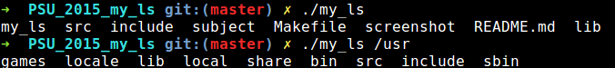

# PSU_2015_my_ls
Epitech first year project : [CPE] PSU_2015_my_ls

First UNIX module project of the first year

Deadline : 2 weeks

Beginning of the project : 16/11/2015, 07h42

Group size : 1 person

# PSU_2015_my_ls

This is a recode of the ls [-lRdrt] [FILE] command

* [ls](http://man7.org/linux/man-pages/man1/ls.1.html)

## Getting started

These instructions will allow you to obtain a copy of the operational project on your local machine for development and testing purposes.

### Prerequisites

What do you need to install the software and how to install it?

```
gcc
make
```

### Installation

Here's how to start the project on your computer

Clone and go in the directory PSU_2015_my_ls

Project compilation

```
make
```

Running project

```
./my_ls
```


## Screenshot



## Build with

* [C](https://en.wikipedia.org/wiki/C_(programming_language))

## Auteurs

* **David Munoz** - [DavidMunoz-dev](https://github.com/davidmunoz-dev)
